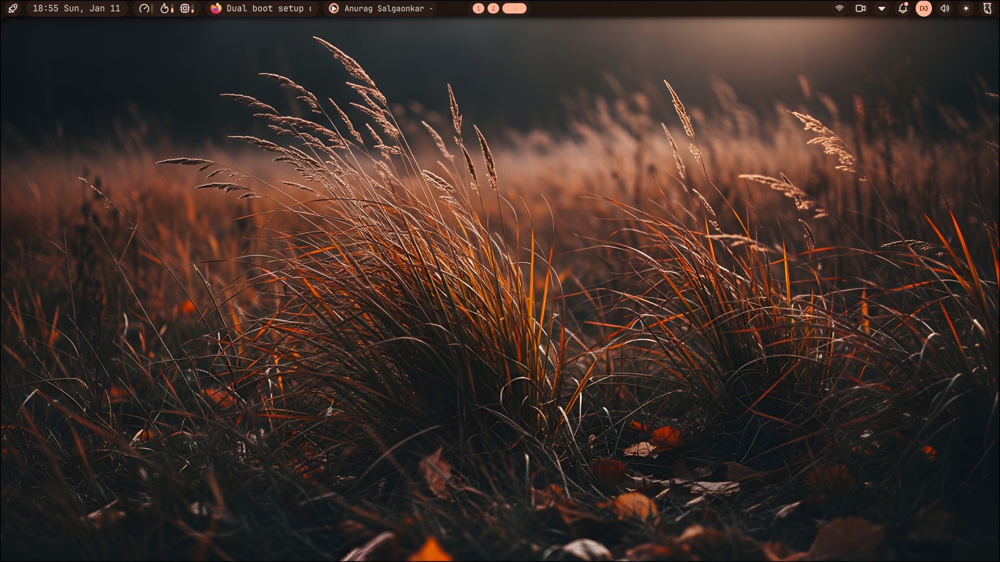
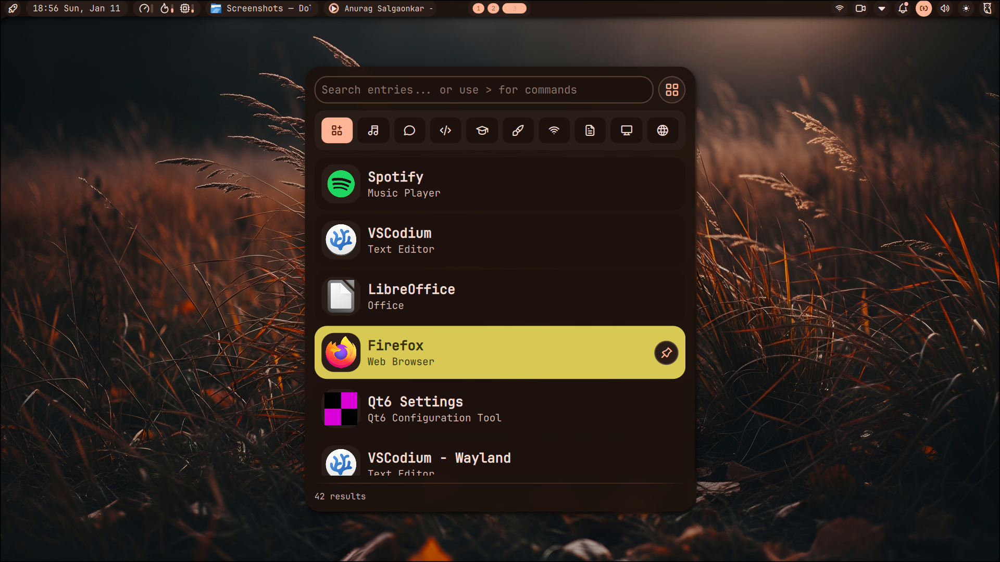
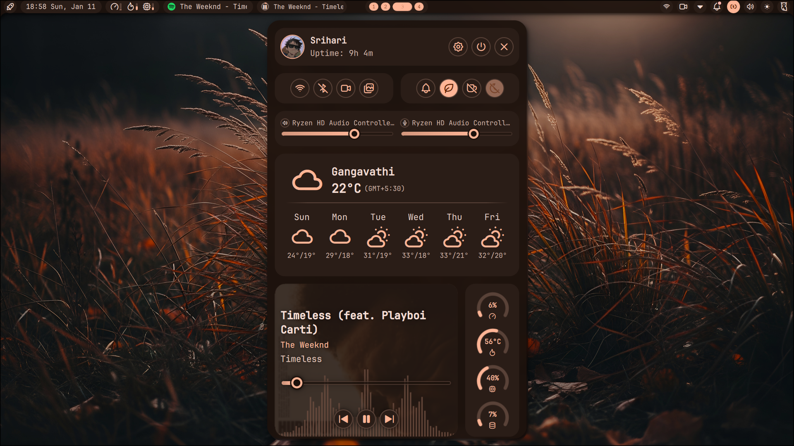
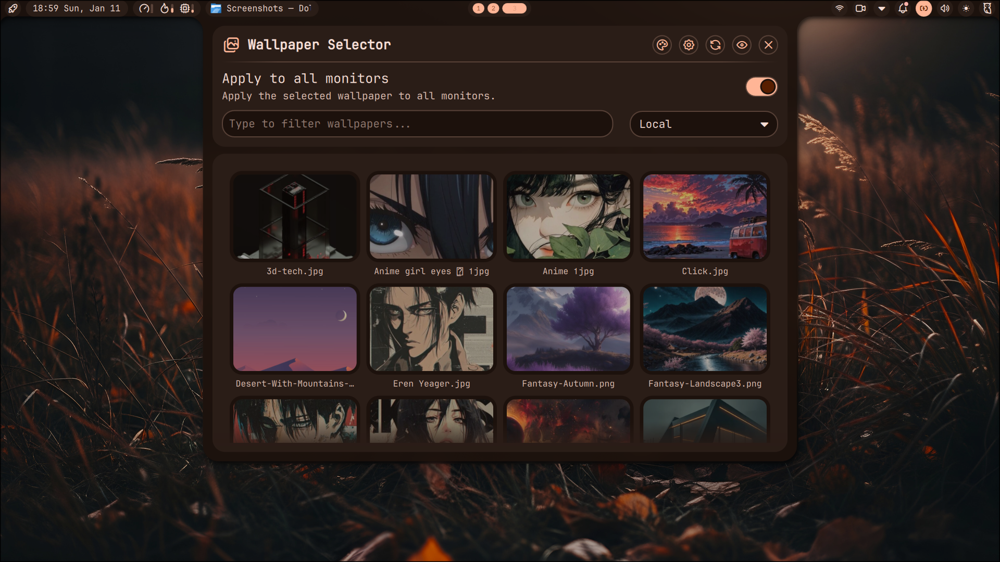
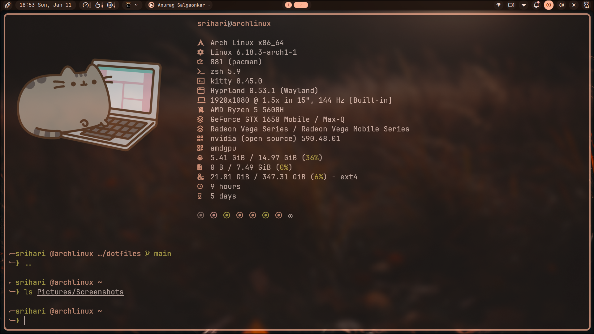
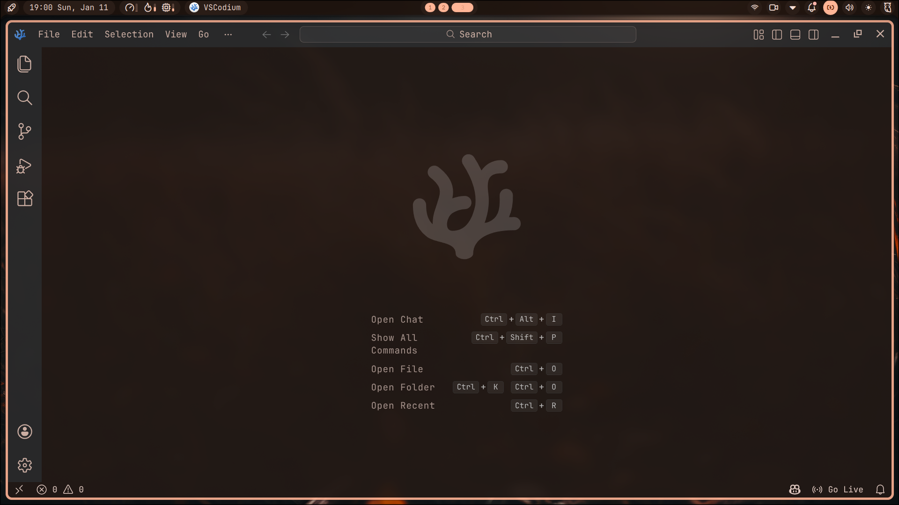
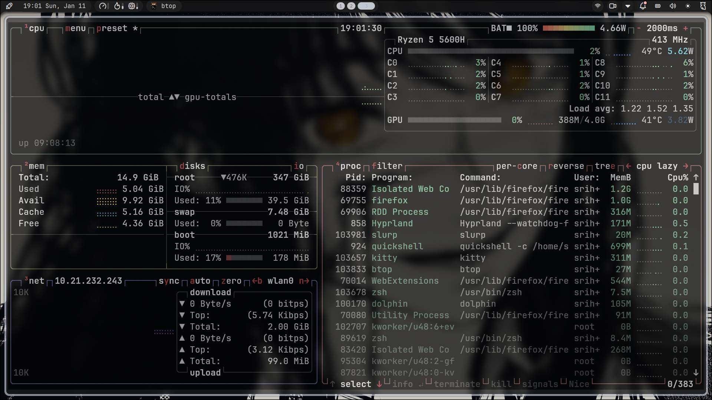
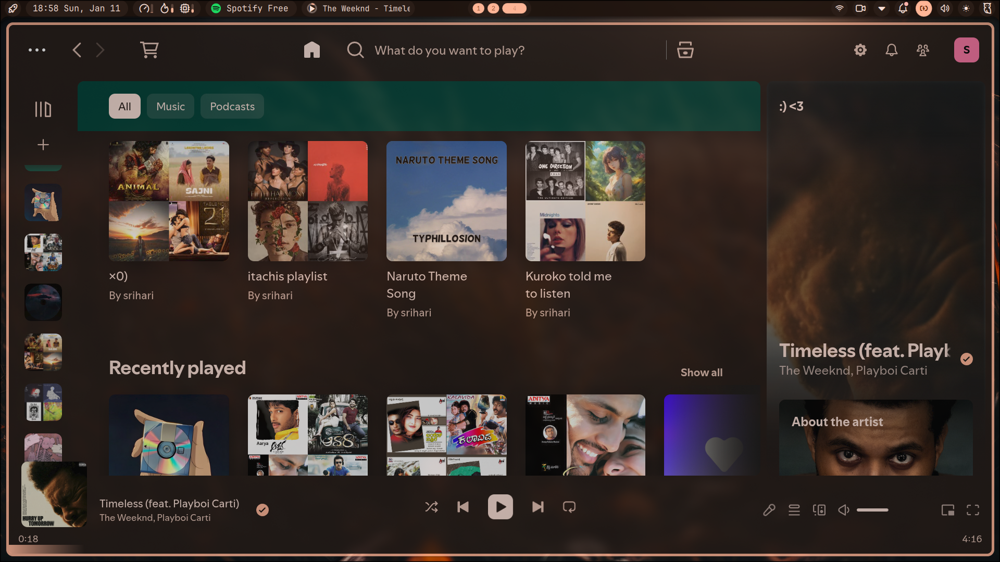

# ⚡ Noctalia-Hyprland Dotfiles

A custom Arch Linux rice built on Hyprland + Quickshell + Noctalia.

Features:
- Noctalia shell (quickshell)
- Hyprland compositor
- Wallpaper-based dynamic theming
- Zsh + Starship terminal


## 🖼 Preview
<p align="center">
  
</p>

A dynamic, glass-style Hyprland desktop built on top of **Noctalia (Quickshell)** with full wallpaper-based theming, custom shell components, and a developer-focused workflow.

---

## 🪟 Hyprland Tiling Workflow

Dynamic tiling, multi-workspace layouts, and floating window support.

<p align="center">
  
  
</p>

---

## 🧭 Noctalia Shell

Custom shell built with Quickshell — launcher, control center, wallpaper system, and panels.

<p align="center">
  
  
</p>

<p align="center">
  
</p>

---

## 💻 Developer Environment

Zsh + Starship terminal, glass VS Codium, and fully themed workflow.

<p align="center">
  
  
</p>

---

## 🌐 Dynamic App Theming

Applications automatically adapt to wallpaper colors.

<p align="center">
  
  
</p>

---
## 📦 Stack
- Hyprland
- Noctalia shell
- Quickshell
- Kitty
- Zsh + Starship
- Matugen

## 🚀 Install

```bash
git clone https://github.com/yourname/yourrepo.git ~/dotfiles
cd ~/dotfiles
chmod +x install.sh
./install.sh
